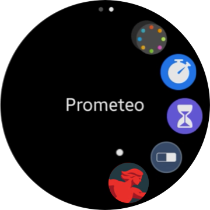
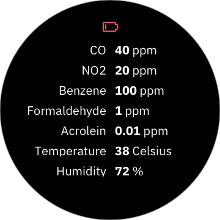

# Pyrrha watch app

 

This repository contains the [Pyrrha](https://github.com/Pyrrha-Platform/Pyrrha) solution application that targets Samsung watches paired with the [sensor device](https://github.com/Pyrrha-Platform/Pyrrha-Firmware) and Samsung [smartphone](https://github.com/Pyrrha-Platform/Pyrrha-Watch-App) carried by the firefighters.

## Current design mockups based on Prometeo branding

The application was originally built with Prometeo mockups and designs. The current project defaults to Pyrrha branding. Work is underway to automate packaging for either type using build flags.

## Features

The watch includes a limited subset of the features proposed in the [original mockup](#original-mockup). It includes:

1. Basic home page with time and 4 readings shared from the device via the mobile app
2. Alerts if one of the readings crosses a threshold which in turn initiates a vibration

The smartphone is responsible for pairing with the watch and the Pyrrha device. The watch receives pushed updates over Bluetooth from the smartphone every second. If any indicator has been red for 5 seconds, it vibrates the watch.

The application is built as a [Tizen Web (Companion) Application](https://developer.samsung.com/galaxy-watch-develop/creating-your-first-app/web-companion/setup-sdk.html) so it uses HTML, JavaScript, and CSS.

## Setting up the development environment

- [Install Tizen Studio](https://developer.tizen.org/development/tizen-studio/download) with the IDE installer. If you're on macOS Big Sur, you may have to [temporarily override security settings](https://support.apple.com/en-us/HT202491) to complete the installation. Take note of the default SDK and Data locations.
- Open the Package Manager and add Samsung SDKs for the watch. The non-LTE [Galaxy Watch 46mm Bluetooth](https://www.samsung.com/es/wearables/galaxy-watch-r800/) and [Galaxy Watch 3 Bluetooth](https://www.samsung.com/us/watches/galaxy-watch3/) are the versions used for testing.
  - In the Main SDK tab, install the [5.5 Wearable](https://developer.samsung.com/galaxy-watch-develop/creating-your-first-app/web-companion/setup-sdk.html) package which will install an emulator, certificates, and web/native development environments.
  - In the Extension SDK tab, install the [Samsung Wearable Extension](https://developer.samsung.com/galaxy-watch-develop/extension-api-reference.html) and [Samsung Certificate Extension](https://developer.samsung.com/galaxy-watch-develop/getting-certificates/install.html). If you don't see them, click the gear icon and scroll down and activate the respective repositories. Then return to the Extension SDK tab to install.

## Run on watch or simulator

1. Open Tizen Studio and select a workspace where you cloned this repository, for example the `workspace` folder in your home directory.
1. Clone this repository, either into the `workspace` folder or elswhere on your computer. For example, I use the `dev` folder in my home directory to store all my clone repositories, including all the other Pyrrha projects.
1. In the Project Explorer pane, click "Create new project". Select Template, then Wearable v5.5. Choose Web Application, then TAU Basic. Name the project `PyrrhaWatchApp` (it can't contain hyphens) and click Finish.
1. Click File > Import... and select a General - File System. Browse to the folder where you clone this repo. selecting the `Pyrrha-Watch-App` folder and its included files. Click finish and overwrite existing files.
1. Open the Emulator Manager under the Tools menu and launch the Wearable Circle device. 
1. Back in Tizen Studio, right click on the `PyrrhaWatchApp` project and "Run as Tizen Web Application 5.5" in simulator.
1. The watch will begin running the app and generating random data to simulate how it works.
1. If it doesn't run, you can click the bottom right watch button and select the app from the list to launch.

## Running on a physical watch

- In order to run the app on a physical device, you'll need to ensure it's built and signed with the Samsung Certificate Extension. 
- You'll need to create a connection to the physical watch over WiFi and set it up in the Device Manager. [Watch this video](https://www.youtube.com/watch?v=BqWjvi9rQuY) to learn more. There may be additional steps required depending on your device or system.

## Continue work and integrate with the Android mobile app

- Install Android Studio according to the [Pyrrha-Mobile-App](https://github.com/Pyrrha-Platform/Pyrrha-Mobile-App) documentation.

## Original mockup based on Prometeo branding

## Contributing

Please read [CONTRIBUTING.md](CONTRIBUTING.md) for details on our code of conduct, and the process for submitting Pyrrha pull requests.

## License

This project is licensed under the Apache 2 License - see the LICENSE file for details. Refer to the respective licenses in the code for the Samsung and Tizen APIs.
